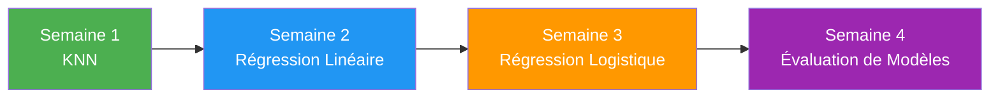
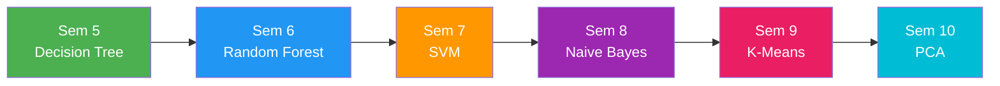
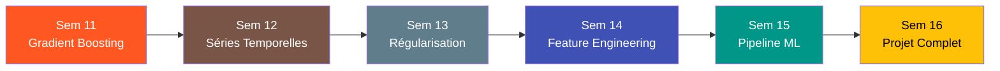
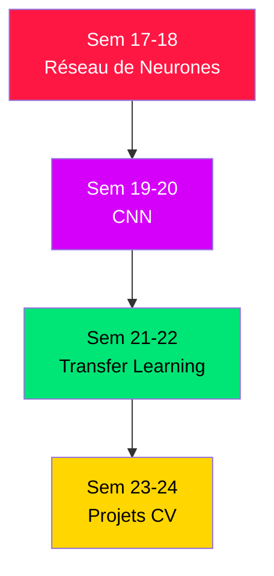

# 🚀 Machine Learning — Projets, Roadmap & Stratégie LinkedIn

> **Document personnalisé** basé sur l'analyse complète de tes dossiers :
> `Working Folder`, `datasetCsv`, et `datasets zip/rar`.

---

## 📦 Inventaire Complet de tes Datasets

### Datasets CSV (tabulaires)

| Dataset | Taille | Colonnes Clés | Type de Problème |
|---------|--------|---------------|-----------------|
| **Iris.csv** | 150 lignes | SepalLength, SepalWidth, PetalLength, PetalWidth, Species | Classification multi-classe |
| **titanic.csv** | ~887 lignes | Survived, Pclass, Sex, Age, Fare | Classification binaire |
| **house-price.csv** | ~545 lignes | price, area, bedrooms, bathrooms, stories, furnishing... | Régression |
| **stocks.csv** | Séries temporelles | Date, MSFT, KLM, ING, MOS | Séries temporelles / Régression |
| **BTC-EUR.csv** | Séries temporelles | Date, Open, High, Low, Close, Volume | Séries temporelles / Prédiction |
| **GLB.Ts+dSST.csv** | 1880–présent | Year, Jan–Dec, anomalies de température | Séries temporelles / Régression |
| **chickweight.csv** | ~578 lignes | weight, Time, Chick, Diet | Régression / ANOVA |
| **mtcars.csv** | 32 lignes | model, mpg, cyl, hp, wt, gear... | Régression / Classification |
| **drawndata1.csv** | ~200 lignes | x, y, z (catégorie) | Clustering / Classification |
| **customers-10000.csv** | 10 000 lignes | Name, Company, City, Country, Email, Subscription... | Segmentation / Clustering |
| **people-10000.csv** | 10 000 lignes | Name, Sex, Email, Date of birth, Job Title | Analyse / Classification |
| **products-10000.csv** | 10 000 lignes | Name, Brand, Category, Price, Stock, Color, Size | Recommandation / Régression |
| **organizations-10000.csv** | 10 000 lignes | Name, Country, Industry, Founded, Employees | Clustering / Analyse |
| **monopoly.csv** | 22 lignes | name, rent, house costs, deed cost, color | Fun / Analyse exploratoire |
| **dependencies.csv** | ~10 000 lignes | project, required, dep | Analyse de graphe |
| **plot4ai_cards.csv** | IA & Éthique | questions, threats, labels, recommendations | NLP / Classification de texte |
| **CityTable / CountryTable / LanguageTable** | Référence | Données géographiques relationnelles | Jointures / Data Engineering |

### Datasets Images (ZIP)

| Dataset | Taille | Type |
|---------|--------|------|
| **Medical mask.zip** | 2.5 GB | Détection d'objets (masques médicaux) — Computer Vision |
| **Teeth Segmentation.zip** | 4.5 GB | Segmentation d'images dentaires — Deep Learning |
| **Supermarket shelves.zip** | 137 MB | Détection d'objets sur étagères — Computer Vision |

### Archives CSV supplémentaires (ZIP)
- `customers-100000.zip`, `organizations-100000.zip`, `people-100000.zip`, `products-100000.zip` → Versions étendues (100K lignes) pour tester le passage à l'échelle

### Notebooks existants (Working Folder)
- ✅ `LearnNumpy.ipynb` — NumPy maîtrisé
- ✅ `LearnPandas.ipynb` — Pandas maîtrisé
- ✅ `LearnMatplot.ipynb` — Matplotlib maîtrisé
- ✅ `LearnScipy.ipynb` — SciPy maîtrisé
- 🔄 `LearnSKLearn.ipynb` — En cours
- 📋 `index.ipynb` — Index/sommaire

---

## 🎯 PARTIE 1 : Tous les Projets Réalisables avec tes Données

### 🟢 Niveau Débutant (Semaines 1–4)

#### Projet 1 — 🌸 Classification des Iris (From Scratch)
> **Dataset** : `Iris.csv` · **Type** : Classification multi-classe

**Objectif** : Prédire l'espèce d'une fleur (Setosa, Versicolor, Virginica) à partir de 4 mesures.

**Ce que tu apprends** :
- Implémenter **KNN (K-Nearest Neighbors) from scratch** avec NumPy
- Comprendre la **distance euclidienne**, le vote par majorité
- **Train/Test Split** manuel
- Métriques : Accuracy, Matrice de confusion
- Visualisation 2D des frontières de décision

**Post LinkedIn** : *"J'ai codé KNN from scratch en Python 🐍 — voici comment 4 mesures de pétales suffisent pour identifier 3 espèces de fleurs avec 96% de précision."*

---

#### Projet 2 — 🏠 Prédiction du Prix Immobilier (Régression Linéaire)
> **Dataset** : `house-price.csv` · **Type** : Régression

**Objectif** : Estimer le prix d'une maison à partir de ses caractéristiques (surface, chambres, etc.)

**Ce que tu apprends** :
- **Régression Linéaire from scratch** (descente de gradient)
- Feature engineering : encodage One-Hot (mainroad, furnishing...)
- Normalisation des features (Min-Max, Z-score)
- Métriques : MSE, RMSE, R²
- Visualiser les residuals

**Post LinkedIn** : *"J'ai implémenté la descente de gradient from scratch pour prédire les prix immobiliers 🏡 — voici la math derrière et mon code Python."*

---

#### Projet 3 — 🚗 Prédiction de Consommation (Régression Simple)
> **Dataset** : `mtcars.csv` · **Type** : Régression

**Objectif** : Prédire la consommation (mpg) en fonction de la puissance, du poids, etc.

**Ce que tu apprends** :
- **Régression Linéaire Simple** (1 variable → mpg)
- Visualisation : Scatter plot + droite de régression
- Corrélation de Pearson
- Régression multiple et impact de chaque feature
- Introduction au concept de **multicolinéarité**

---

### 🟡 Niveau Intermédiaire (Semaines 5–10)

#### Projet 4 — 🚢 Survie du Titanic (Classification Complète)
> **Dataset** : `titanic.csv` · **Type** : Classification binaire

**Objectif** : Prédire si un passager survit ou non.

**Ce que tu apprends** :
- **Régression Logistique from scratch** (fonction sigmoïde, log-loss)
- **Arbre de Décision from scratch** (critère de Gini, entropie)
- Nettoyage de données avancé (valeurs manquantes, outliers)
- Feature Engineering (extraire le titre du nom, créer des bins d'âge)
- Comparaison de modèles + cross-validation
- Métriques : Précision, Rappel, F1-Score, AUC-ROC

**Post LinkedIn** : *"Régression Logistique vs Arbre de Décision : lequel prédit mieux la survie sur le Titanic ? Voici mon implémentation from scratch et mes résultats 🚢📊"*

---

#### Projet 5 — 📊 Segmentation de Clientèle (Clustering)
> **Dataset** : `customers-10000.csv` + `organizations-10000.csv` · **Type** : Non-supervisé

**Objectif** : Regrouper les clients en segments exploitables pour le marketing.

**Ce que tu apprends** :
- **K-Means from scratch** (initialisation, centroïdes, itérations)
- Méthode du Coude (Elbow Method) pour choisir K
- **PCA from scratch** pour la réduction de dimension
- Silhouette Score
- Interprétation business des clusters
- DBSCAN comme alternative

**Post LinkedIn** : *"J'ai segmenté 10 000 clients en 5 groupes exploitables avec K-Means codé from scratch — voici les insights et le code 🎯"*

---

#### Projet 6 — 📈 Analyse & Prédiction Boursière (Séries Temporelles)
> **Datasets** : `stocks.csv` + `BTC-EUR.csv` · **Type** : Séries temporelles

**Objectif** : Analyser les tendances des actions (MSFT, KLM, ING, MOS) et du Bitcoin.

**Ce que tu apprends** :
- Manipulation des séries temporelles avec Pandas (DatetimeIndex, resample)
- Moyennes mobiles (SMA, EMA)
- Rendements journaliers, volatilité
- Corrélation entre actifs
- Visualisations interactives (candlestick charts)
- Introduction aux modèles ARIMA

**Post LinkedIn** : *"J'ai analysé 20 ans de données boursières (MSFT, BTC) et voici ce que les moyennes mobiles révèlent sur les tendances du marché 📈🧠"*

---

#### Projet 7 — 🌡️ Prédiction du Réchauffement Climatique
> **Dataset** : `GLB.Ts+dSST.csv` (NASA) · **Type** : Régression / Séries temporelles

**Objectif** : Analyser et prédire les anomalies de température terrestre depuis 1880.

**Ce que tu apprends** :
- Données de la NASA : contexte scientifique
- Tendances à long terme vs variations saisonnières
- Régression polynomiale
- Décomposition de séries temporelles (trend, saisonnalité, résidu)
- Prédiction future avec intervalle de confiance

**Post LinkedIn** : *"J'ai analysé 145 ans de données NASA sur le climat 🌍 — voici ma modélisation du réchauffement climatique avec Python."*

---

#### Projet 8 — 🐣 Analyse de Croissance (ANOVA & Régression)
> **Dataset** : `chickweight.csv` · **Type** : Régression / Analyse statistique

**Objectif** : Analyser l'impact de 4 régimes alimentaires sur la croissance des poussins.

**Ce que tu apprends** :
- Analyse de la variance (**ANOVA**)
- Régression avec variables catégorielles (Diet)
- Courbes de croissance par groupe
- Tests statistiques (t-test, ANOVA)
- Visualisation : Box plots, Violin plots, courbes superposées

---

#### Projet 9 — 🎲 Optimisation Stratégique au Monopoly
> **Dataset** : `monopoly.csv` · **Type** : Analyse exploratoire / Optimisation

**Objectif** : Déterminer les propriétés les plus rentables au Monopoly avec des données.

**Ce que tu apprends** :
- Retour sur investissement (ROI)
- Analyse coût-bénéfice
- Visualisation comparative
- Pensée analytique appliquée à un problème fun

---

### 🔴 Niveau Avancé (Semaines 11–20)

#### Projet 10 — 🎭 Random Forest & Ensemble Methods
> **Datasets** : `titanic.csv` + `house-price.csv` · **Type** : Classification + Régression

**Objectif** : Implémenter les méthodes d'ensemble pour améliorer les prédictions.

**Ce que tu apprends** :
- **Bagging from scratch** (Bootstrap Aggregating)
- **Random Forest from scratch** (sous-échantillonnage de features)
- **Gradient Boosting** (concept d'apprentissage séquentiel)
- Comparaison : Arbre simple vs Random Forest vs Boosting
- Feature Importance

**Post LinkedIn** : *"Un arbre = faible. Une forêt = puissante 🌲🌲🌲 Voici comment j'ai codé Random Forest from scratch et amélioré mes prédictions de 15%."*

---

#### Projet 11 — 🧠 SVM (Support Vector Machine) from Scratch
> **Datasets** : `Iris.csv` + `drawndata1.csv` · **Type** : Classification

**Objectif** : Implémenter SVM et comprendre les hyperplans de séparation.

**Ce que tu apprends** :
- **SVM linéaire from scratch** (optimisation de la marge maximale)
- Kernel trick (RBF, polynomial)
- Visualisation des frontières de décision en 2D
- Comparaison SVM vs KNN vs Logistic Regression

**Post LinkedIn** : *"Comment SVM trouve l'hyperplan optimal pour séparer des données non-linéaires ? Voici mon implémentation from scratch avec visualisation 🎯"*

---

#### Projet 12 — 🧬 Naive Bayes & NLP
> **Dataset** : `plot4ai_cards.csv` · **Type** : Classification de texte

**Objectif** : Classifier automatiquement les risques IA à partir de descriptions textuelles.

**Ce que tu apprends** :
- **Naive Bayes from scratch** (théorème de Bayes appliqué)
- Prétraitement NLP : Tokenization, TF-IDF, Bag of Words
- Classification de texte multi-label
- Application éthique de l'IA
- Métriques pour le multi-label

**Post LinkedIn** : *"J'ai codé un classifieur de risques IA avec Naive Bayes from scratch 🤖⚖️ — voici comment le théorème de Bayes s'applique au NLP."*

---

#### Projet 13 — 🛒 Système de Recommandation
> **Datasets** : `products-10000.csv` + `customers-10000.csv` · **Type** : Filtrage collaboratif

**Objectif** : Recommander des produits aux clients basé sur leurs profils.

**Ce que tu apprends** :
- Content-based filtering
- Cosine Similarity from scratch
- Systèmes de recommandation hybrides
- Matrice utilisateur-produit (sparse matrix)
- Évaluation : Precision@K, Recall@K

---

#### Projet 14 — 🔗 Analyse de Graphe de Dépendances
> **Dataset** : `dependencies.csv` · **Type** : Analyse de graphe

**Objectif** : Visualiser et analyser les dépendances entre packages Python.

**Ce que tu apprends** :
- Théorie des graphes appliquée
- NetworkX pour la construction de graphes
- Centralité (betweenness, degree)
- Détection de communautés
- Visualisation de réseaux complexes

---

### 🟣 Niveau Expert — Deep Learning (Semaines 21+)

#### Projet 15 — 😷 Détection de Masques Médicaux (Computer Vision)
> **Dataset** : `Medical mask.zip` (2.5 GB) · **Type** : Détection d'objets

**Objectif** : Détecter automatiquement si une personne porte un masque médical.

**Ce que tu apprends** :
- **CNN (Convolutional Neural Network)** avec TensorFlow/Keras
- Transfer Learning (VGG16, ResNet, MobileNet)
- Data Augmentation
- Détection d'objets (YOLO, SSD)
- Déploiement d'un modèle

---

#### Projet 16 — 🦷 Segmentation Dentaire (Image Segmentation)
> **Dataset** : `Teeth Segmentation.zip` (4.5 GB) · **Type** : Segmentation sémantique

**Objectif** : Segmenter automatiquement les dents sur des images dentaires.

**Ce que tu apprends** :
- Architecture **U-Net** pour la segmentation
- Masques de segmentation (masks)
- Dice Loss, IoU (Intersection over Union)
- Entraînement sur GPU
- Modèle médical à impact réel

---

#### Projet 17 — 🛒 Détection de Produits sur Étagères
> **Dataset** : `Supermarket shelves.zip` (137 MB) · **Type** : Détection d'objets

**Objectif** : Détecter et compter les produits sur des étagères de supermarché.

**Ce que tu apprends** :
- **YOLO** (You Only Look Once)
- Annotations et bounding boxes
- mAP (mean Average Precision)
- Application industrielle directe (retail analytics)

---

#### Projet 18 — 🔄 Données à l'Échelle (Big Data + ML)
> **Datasets** : Archives ZIP 100K (customers, organizations, people, products) · **Type** : Passage à l'échelle

**Objectif** : Reproduire les projets précédents sur des datasets 10x plus grands.

**Ce que tu apprends** :
- Gestion de la mémoire (chunked reading, Dask)
- Optimisation des algorithmes ML pour les grands datasets
- Parallélisation
- Pipeline ML complet à grande échelle

---

## 🗺️ PARTIE 2 : Roadmap d'Apprentissage ML (From Scratch → Expert)

> Chaque "module" = **1 algorithme appris from scratch** = **1 post LinkedIn**

### 📌 Phase 0 : Prérequis (✅ Déjà acquis)

Tu as déjà les bases :
- ✅ Python, NumPy, Pandas, Matplotlib, SciPy
- 🔄 Scikit-learn (en cours)

---

### 📌 Phase 1 : Fondamentaux du ML (Semaines 1–4)



#### 📗 Semaine 1 : KNN (K-Nearest Neighbors)
| Élément | Détail |
|---------|--------|
| **Concept** | Classification par proximité — "Dis-moi qui sont tes voisins, je te dirai qui tu es" |
| **Math requise** | Distance euclidienne, vote par majorité |
| **Dataset** | `Iris.csv` |
| **Implémentation** | KNN from scratch avec NumPy uniquement |
| **Validation** | Comparer avec `sklearn.neighbors.KNeighborsClassifier` |
| **Post LinkedIn** | Template ci-dessous |

#### 📘 Semaine 2 : Régression Linéaire
| Élément | Détail |
|---------|--------|
| **Concept** | Trouver la meilleure droite qui passe par les données |
| **Math requise** | Descente de gradient, fonction de coût MSE, dérivées partielles |
| **Dataset** | `house-price.csv`, `mtcars.csv` |
| **Implémentation** | Régression linéaire simple puis multiple from scratch |
| **Validation** | Comparer avec `sklearn.linear_model.LinearRegression` |
| **Post LinkedIn** | Focus sur la descente de gradient |

#### 📙 Semaine 3 : Régression Logistique
| Élément | Détail |
|---------|--------|
| **Concept** | Classification binaire via la fonction sigmoïde |
| **Math requise** | Sigmoïde, log-loss (binary cross-entropy), gradient |
| **Dataset** | `titanic.csv` |
| **Implémentation** | Régression logistique from scratch |
| **Validation** | Comparer avec `sklearn.linear_model.LogisticRegression` |
| **Post LinkedIn** | "De la régression à la classification : comment la sigmoïde change tout" |

#### 📕 Semaine 4 : Métriques & Évaluation
| Élément | Détail |
|---------|--------|
| **Concept** | Comment évaluer correctement un modèle ML |
| **Sujets** | Accuracy, Précision, Rappel, F1, AUC-ROC, Matrice de confusion, Cross-validation |
| **Dataset** | Reprendre Titanic et Iris |
| **Implémentation** | Coder chaque métrique from scratch |
| **Post LinkedIn** | "Accuracy = 95% mais mon modèle est nul ? Voici pourquoi les métriques ML sont contre-intuitives" |

---

### 📌 Phase 2 : Algorithmes Classiques (Semaines 5–10)



#### 🌳 Semaine 5 : Arbre de Décision
- **Concept** : Diviser les données en posant des questions binaires
- **Math** : Entropie, Gain d'information, Critère de Gini
- **Dataset** : `titanic.csv`
- **From scratch** : Construire l'arbre récursivement
- **Post LinkedIn** : *"Comment un arbre de décision 'pense' — implémenté from scratch avec le critère de Gini 🌳"*

#### 🌲 Semaine 6 : Random Forest & Ensemble Methods
- **Concept** : La puissance de la combinaison de modèles faibles
- **Math** : Bootstrap, agrégation, sous-échantillonnage de features
- **Dataset** : `titanic.csv` + `house-price.csv`
- **From scratch** : Bagging puis Random Forest
- **Post LinkedIn** : *"La sagesse des foules appliquée au ML : voici Random Forest from scratch 🌲🌲🌲"*

#### ⚔️ Semaine 7 : SVM (Support Vector Machines)
- **Concept** : Trouver l'hyperplan de marge maximale
- **Math** : Optimisation convexe, multiplicateurs de Lagrange (simplifié), kernel trick
- **Dataset** : `Iris.csv`, `drawndata1.csv`
- **From scratch** : SVM linéaire avec descente de gradient
- **Post LinkedIn** : *"SVM from scratch : comment trouver la frontière de décision optimale ⚔️"*

#### 📊 Semaine 8 : Naive Bayes
- **Concept** : Classification probabiliste basée sur le théorème de Bayes
- **Math** : Probabilités conditionnelles, indépendance naïve
- **Dataset** : `plot4ai_cards.csv` (NLP), `Iris.csv`
- **From scratch** : Gaussian Naive Bayes + Multinomial Naive Bayes
- **Post LinkedIn** : *"Le théorème de Bayes comme algorithme de ML : simple, rapide, et étonnamment efficace 📊"*

#### 🎯 Semaine 9 : K-Means Clustering
- **Concept** : Apprentissage non-supervisé — grouper sans étiquettes
- **Math** : Distance intra-cluster, centroïdes, convergence
- **Dataset** : `customers-10000.csv`, `drawndata1.csv`
- **From scratch** : K-Means + méthode du coude + silhouette
- **Post LinkedIn** : *"L'IA sans étiquettes : comment K-Means découvre des patterns cachés dans 10 000 clients 🎯"*

#### 🔬 Semaine 10 : PCA (Analyse en Composantes Principales)
- **Concept** : Réduire la dimension des données tout en gardant l'information
- **Math** : Valeurs propres, vecteurs propres, variance expliquée
- **Dataset** : `customers-10000.csv`, `Iris.csv`
- **From scratch** : PCA avec décomposition spectrale
- **Post LinkedIn** : *"De 10 dimensions à 2 : voici comment PCA compresse les données sans perdre l'essentiel 🔬"*

---

### 📌 Phase 3 : Modèles Avancés (Semaines 11–16)



#### 🚀 Semaine 11 : Gradient Boosting
- **Concept** : Construire des modèles séquentiels qui corrigent les erreurs du précédent
- **Math** : Descente de gradient dans l'espace des fonctions, learning rate
- **Dataset** : `house-price.csv`, `titanic.csv`
- **Post LinkedIn** : *"XGBoost décodé : comment le Gradient Boosting domine les compétitions Kaggle 🏆"*

#### 📈 Semaine 12 : Séries Temporelles & ARIMA
- **Concept** : Prédire l'avenir à partir du passé
- **Math** : Autocorrélation, stationnarité, différenciation
- **Dataset** : `stocks.csv`, `BTC-EUR.csv`, `GLB.Ts+dSST.csv`
- **Post LinkedIn** : *"Prédire le cours du Bitcoin avec ARIMA : possible ou impossible ? Mon analyse 📈"*

#### 🛡️ Semaine 13 : Régularisation (Ridge, Lasso, ElasticNet)
- **Concept** : Empêcher le surapprentissage (overfitting)
- **Math** : Pénalisation L1, L2, compromis biais-variance
- **Dataset** : `house-price.csv`
- **Post LinkedIn** : *"Overfitting : le piège n°1 du ML et comment Ridge & Lasso le résolvent 🛡️"*

#### 🔧 Semaine 14 : Feature Engineering Avancé
- **Concept** : L'art de transformer les données brutes en features utiles
- **Sujets** : Encodage, binning, interactions, feature selection
- **Dataset** : Tous les datasets CSV
- **Post LinkedIn** : *"En ML, les features comptent plus que l'algorithme — voici mes techniques de feature engineering 🔧"*

#### 🔄 Semaine 15 : Pipeline ML Complet
- **Concept** : Automatiser tout le workflow (preprocessing → training → evaluation)
- **Sujets** : Sklearn Pipelines, GridSearchCV, MLflow
- **Post LinkedIn** : *"D'un notebook désordonné à un pipeline ML reproductible : voici ma transformation 🔄"*

#### 🏁 Semaine 16 : Projet Complet Portfolio
- **Dataset** : Combiner customers + products + organizations
- **Objectif** : Un projet end-to-end avec rapport, visualisations, et déploiement
- **Post LinkedIn** : *"Mon premier projet ML complet : de l'EDA au déploiement, voici tout le parcours 🏁"*

---

### 📌 Phase 4 : Deep Learning (Semaines 17–24)



#### 🧠 Semaines 17–18 : Réseau de Neurones from Scratch
- **Concept** : Perceptron, couches cachées, backpropagation
- **Math** : Fonctions d'activation (ReLU, sigmoid), chain rule, gradient
- **Dataset** : `Iris.csv`, `titanic.csv`
- **Post LinkedIn** : *"J'ai codé un réseau de neurones from scratch en Python — 0 framework, juste NumPy et des maths 🧠"*

#### 🖼️ Semaines 19–20 : CNN (Convolutional Neural Networks)
- **Concept** : Convolutions, pooling, architectures CNN
- **Framework** : TensorFlow / Keras
- **Dataset** : `Supermarket shelves.zip` (commencer petit)
- **Post LinkedIn** : *"Comment un ordinateur 'voit' les images : CNN expliqué et implémenté 🖼️"*

#### 🔄 Semaines 21–22 : Transfer Learning
- **Concept** : Réutiliser des modèles pré-entraînés (VGG16, ResNet, MobileNet)
- **Dataset** : `Medical mask.zip`
- **Post LinkedIn** : *"Transfer Learning : entraîner un détecteur de masques avec seulement 100 images 😷"*

#### 🦷 Semaines 23–24 : Projets Computer Vision Avancés
- **Dataset** : `Teeth Segmentation.zip`
- **Concept** : U-Net, segmentation sémantique, Dice loss
- **Post LinkedIn** : *"IA médicale : mon modèle de segmentation dentaire avec U-Net — résultats et leçons apprises 🦷"*

---

## 📱 PARTIE 3 : Stratégie LinkedIn — Template de Post par Algorithme

### Structure de Post (à adapter pour chaque algorithme)

```
🔥 [TITRE ACCROCHEUR — question ou affirmation forte]

[Hook : 1-2 phrases qui donnent envie de lire la suite]

---

📚 Ce que j'ai appris cette semaine :
• [Algorithme] — voici la logique derrière
• [Math clé] — expliquée simplement
• [Piège principal] — ce qui m'a surpris

💻 Ce que j'ai codé :
• Implémentation from scratch (X lignes de Python)
• Comparaison avec scikit-learn → [résultat]
• Dataset utilisé : [nom] → [accuracy/RMSE obtenu]

📊 [IMAGE : graphique, visualisation, ou schéma de l'algorithme]

🧠 La leçon la plus importante :
[1 insight clé que tu retiens]

🔗 Code complet sur mon GitHub : [lien]

#MachineLearning #Python #DataScience #AI #FromScratch
#[Algorithme] #ApprentissageAutomatique
```

### Planning de Publication

| Semaine | Post Principal | Format |
|---------|---------------|--------|
| 1 | KNN from scratch | Carrousel + code |
| 2 | Descente de gradient expliquée | Infographie + vidéo |
| 3 | Sigmoïde & classification | Carrousel |
| 4 | Métriques ML démystifiées | Thread + visuel |
| 5 | Arbre de décision interactif | Carrousel + notebook |
| 6 | Random Forest | Comparaison avant/après |
| 7 | SVM & hyperplans | Animation + code |
| 8 | Naive Bayes pour le NLP | Carrousel |
| 9 | K-Means segmentation | Visualisation clusters |
| 10 | PCA | Réduction de dimension visualisée |
| 11 | Gradient Boosting | Infographie d'ensemble |
| 12 | Prédiction Bitcoin | Graphiques + analyse |
| 13 | Overfitting & régularisation | Thread éducatif |
| 14 | Feature Engineering | Tips & tricks |
| 15 | Pipeline ML | Workflow visuel |
| 16 | Projet complet | Case study détaillé |
| 17–18 | Neural Network from scratch | Post épique + code |
| 19–24 | Deep Learning / CV | Posts projets réels |

---

## 📋 Résumé : Ordre de Priorité des Projets

| # | Projet | Dataset | Algorithme Principal | Difficulté |
|---|--------|---------|---------------------|------------|
| 1 | Classification Iris | Iris.csv | KNN | ⭐ |
| 2 | Prix Immobilier | house-price.csv | Régression Linéaire | ⭐ |
| 3 | Consommation Auto | mtcars.csv | Régression Simple | ⭐ |
| 4 | Survie Titanic | titanic.csv | Logistic + Tree | ⭐⭐ |
| 5 | Segmentation Clients | customers-10000.csv | K-Means | ⭐⭐ |
| 6 | Analyse Boursière | stocks.csv + BTC-EUR.csv | Séries Temporelles | ⭐⭐ |
| 7 | Climat NASA | GLB.Ts+dSST.csv | Régression Poly | ⭐⭐ |
| 8 | Croissance Poussins | chickweight.csv | ANOVA | ⭐⭐ |
| 9 | Monopoly Analytics | monopoly.csv | Analyse | ⭐ |
| 10 | Ensemble Methods | titanic + house-price | Random Forest | ⭐⭐⭐ |
| 11 | SVM | Iris + drawndata1 | SVM | ⭐⭐⭐ |
| 12 | NLP & Éthique IA | plot4ai_cards.csv | Naive Bayes | ⭐⭐⭐ |
| 13 | Recommandation | products + customers | Cosine Similarity | ⭐⭐⭐ |
| 14 | Graphe Dépendances | dependencies.csv | Théorie des Graphes | ⭐⭐⭐ |
| 15 | Détection Masques | Medical mask.zip | CNN + Transfer | ⭐⭐⭐⭐ |
| 16 | Segmentation Dentaire | Teeth Seg.zip | U-Net | ⭐⭐⭐⭐ |
| 17 | Détection Produits | Supermarket.zip | YOLO | ⭐⭐⭐⭐ |
| 18 | Passage à l'Échelle | Archives 100K | Pipeline ML | ⭐⭐⭐⭐ |

---

> [!TIP]
> **Commence toujours par l'implémentation from scratch** avant d'utiliser scikit-learn. C'est ce qui te différenciera sur LinkedIn et te donnera une compréhension profonde que 90% des data scientists n'ont pas.

> [!IMPORTANT]
> **Pour chaque algorithme** : Code from scratch → Compare avec sklearn → Documente → Post LinkedIn. C'est le cycle d'or de l'apprentissage + personal branding.
